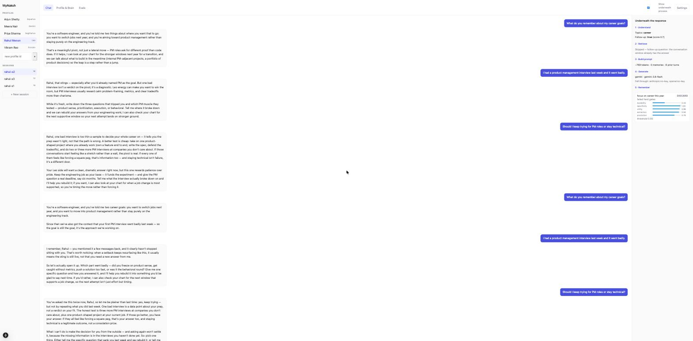
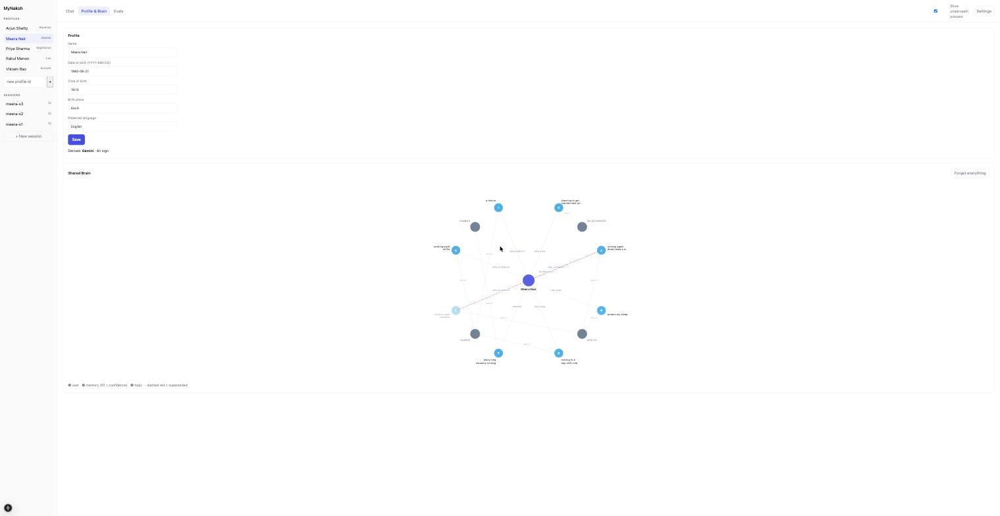
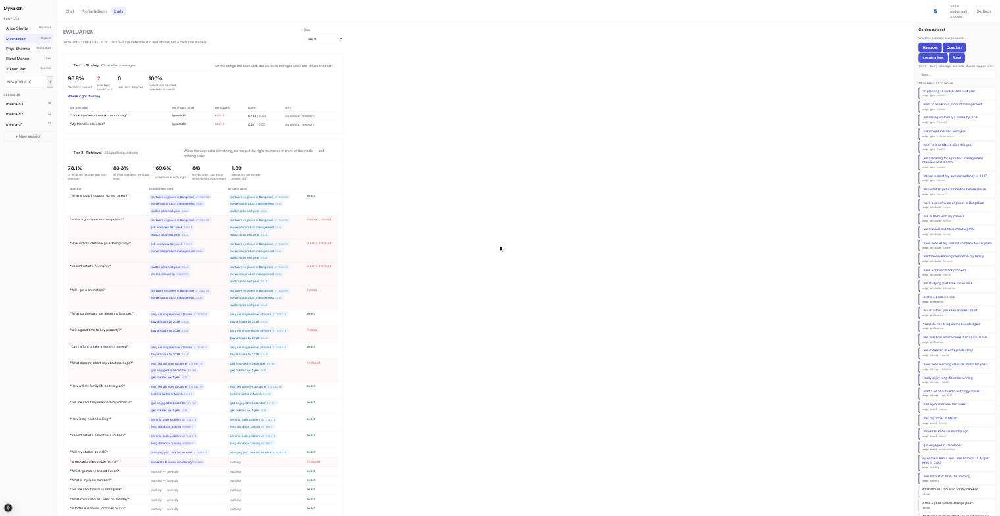

# MyNaksh — Personalized Astrology Chat

A conversational service that remembers. It keeps a **Shared Brain** — a per-user knowledge
graph in Neo4j — alongside short-term conversation context, selects only the relevant slice
of both before calling an LLM, and decides afterwards what was worth remembering.

Built for the ML Machine Coding Assignment (SDE2).

---

## The app

### Chat — with the reasoning on show



The left rail switches between users and their sessions. The right panel is the
**Show underneath process** toggle: for every message it prints the detected topics, the
follow-up verdict, each memory scored against the retrieval floor, the prompt budget, which
provider answered, and the promotion decision with its component bars. Here the reply is
answering from the previous session's memories, and the trace shows retrieval was skipped
because the question was classified as a follow-up.

### Profile & Brain — the graph for one user



Profile fields with the zodiac derived from the birth date, and the live Shared Brain.
Node fill is confidence, the badge is the memory type, grey nodes are topics, and the
**red dashed edge is a `SUPERSEDES`** — here Meera said she had stopped running and later
corrected it, so the old memory is faded rather than deleted.

### Evals — every number, and the data behind it



All four tiers with their metrics, the full weight sweep with the winning value for each
constant highlighted, and the four models ranked. Memories are shown by what they say, not
by their id. The **Golden dataset** panel on the right is the data being scored against —
every labelled message, every question with the memories it should surface, the conversation
scripts and the labelling rules. The **Run** picker at the top reloads any previous run.

---

## Quick start

Nothing below needs an API key or a database. With neither, the app runs on a deterministic
mock provider and in-process stores, and the full test suite still passes.

```bash
# 1 - databases (optional; the app falls back gracefully without them)
docker compose up -d

# 2 - backend
cd backend
python3 -m venv .venv && .venv/bin/pip install -r requirements.txt
cp .env.example .env                # then add whichever provider keys you have
.venv/bin/uvicorn server:app --reload --port 8000

# 3 - frontend
cd frontend && npm install && npm run dev      # http://localhost:3000
```

```bash
cd backend && .venv/bin/python -m pytest tests -q     # 31 tests, no infra needed
cd frontend && npm test                               # 17 tests
```

The frontend talks only to its own origin; `next.config.js` rewrites `/api/*` to the
backend, so there is no CORS to configure and no API host baked into the browser bundle.

---

## Configuration

All settings live in **`backend/.env`** (template: `backend/.env.example`), loaded on
startup by `python-dotenv`. Every value is optional — with an empty file the app runs on
the mock provider and the in-process stores, and the whole test suite still passes.

| Variable | Default | Purpose |
|---|---|---|
| `ANTHROPIC_API_KEY` `OPENAI_API_KEY` `GEMINI_API_KEY` `OPENROUTER_API_KEY` | — | provider keys; a provider without one is shown unavailable and skipped by the fallback chain |
| `OLLAMA_URL` | `http://localhost:11434` | local Ollama, no key needed |
| `LLM_PROVIDER` | — | default provider; blank walks the fallback chain |
| `LLM_FALLBACK` | `anthropic,openai,gemini,openrouter,ollama,mock` | order tried on failure |
| `NEO4J_URI` `NEO4J_USER` `NEO4J_PASSWORD` | `bolt://localhost:7687` `neo4j` `astrobot123` | Shared Brain |
| `MONGO_URI` | `mongodb://localhost:27017` | session turns |
| `BRAIN` / `SESSIONS` | `neo4j` / `mongo` | set either to `memory` to force the in-process store and skip the connection attempt |

Two rules worth knowing: a real environment variable **overrides** the file (so Docker and
CI can inject settings without editing it), and `constants.py` is the **only** module that
reads `os.getenv` — that env block is the complete list of what `.env` can change.
`backend/.env` is gitignored; `.env.example` is committed.

---

## Architecture

```
POST /chat
    |
    v
 1 understand   topics + follow-up detection      (rules, no LLM)
 2 retrieve     score memories, keep top-6 above the floor
 3 build        assemble a token-budgeted prompt
 4 generate     LLM provider, with a fallback chain
 5 reply        user has their answer here
 6 remember     extract -> gate -> write to the graph  (after the reply)
```

```
backend/
  constants.py          every tunable, bucketed by where it is used
  utils.py              every formula, pure functions, no I/O
  server.py             FastAPI routes only
  modules/
    llm/                provider contract + registry + 5 providers + mock
    brain/              Neo4j graph store, in-process fallback, retrieval
    memory/             LLM extraction, promotion gate, conflict resolution
    chat/               orchestrator, prompt assembly
    session/            MongoDB turn store, in-process fallback
    profile/            profile CRUD, stubbed astrology
  tests/                21 tests (pytest)
  evals/                empty - where prior tuning will live
frontend/src/
  app/                  Next.js shell
  modules/              chat, graph, profile, settings, api client
  modules/__tests__/    12 tests (Jest + Testing Library)
docs/
  architecture.md       diagrams + the formula sheet (section 8)
  design-rationale.md   why every constant is what it is
```

### Three memory tiers

| Tier | Holds | Store | Lifetime |
|---|---|---|---|
| **Working** | last 6 turns | in-process | the session |
| **Episodic** | every turn, verbatim | MongoDB | forever |
| **Semantic** | durable facts about the user | Neo4j | forever, with decay |

Everything flows into episodic. Almost nothing is promoted to semantic — that promotion
decision is the heart of the system.

---

## Shared Brain schema

```
(:User {user_id, name, dob, tob, birth_place, language, zodiac, element})
  -[:HAS_GOAL | PREFERS | INTERESTED_IN | HAS_ATTRIBUTE | REMEMBERS]->
(:Memory {id, type, value, confidence, status, embedding, source_message, last_affirmed})
  -[:ABOUT]-> (:Topic {name})

(:Memory)-[:SUPERSEDES]->(:Memory)     # correction trail, old node kept
```

**Profile fields are properties on `:User`** — one value each, always relevant, no node needed.
**Learned facts are `:Memory` nodes** — each needs confidence, provenance and a correction history.
**`:Topic` nodes are shared** across memories, which makes retrieval a bounded 2-hop traversal
(`User -> Memory -> Topic`) instead of a scan.

Constraints on `User.user_id`, `Memory.id`, `Topic.name`; index on `Memory.status`.

---

## Memory strategy — what gets remembered

Three hard gates first, all deterministic and free:

1. **Self-referential** — the user is the subject
2. **Declarative** — asserts rather than asks
3. **Resolvable** — there is an actual value

Survivors get a **type**, and the type carries a half-life and a cardinality:

| Type | Half-life | Cardinality |
|---|---|---|
| `IDENTITY` | never decays | single |
| `PREFERENCE` | 24 mo | single per slot |
| `ATTRIBUTE` | 18 mo | single per slot |
| `INTEREST` | 12 mo | multi |
| `GOAL` | 9 mo or target date | multi |
| `EVENT` | 6 mo | multi |
| `STATE` | **never promoted** | — |

`STATE` is the general rule for short-term, stated as a test rather than a list:

> If it will probably be false in 30 days **and** recalling it later would be misleading
> rather than useful, it is a `STATE`. It stays episodic.

Then a score, promoting at ≥ 0.60:

```
promotion = 0.35·durability + 0.25·specificity + 0.25·utility + 0.15·extraction_conf
```

One term per independent failure mode — storing something that stops being true, something
too vague to use, something useless, or something we misread.

### Updating existing memories

```
REINFORCE  c <- c + 0.15(1-c)     same meaning; asymptotic, never exceeds 1
SUPERSEDE                         single-valued slot, different value
COEXIST                           multi-valued; two career goals are both true
WEAK CONTRADICTION  c <- c x 0.7  ambiguous; reversible, unlike deletion
```

**Cardinality, not similarity, authorizes a supersede.** A new city replaces the old city.
A new goal does not replace an old goal.

Decay is computed **at read time** — no cron, no sweep:
`decay = 0.5 ^ (age / half_life)`

---

## Context selection

```
score     = relevance x confidence x importance x decay      (product: relevance can veto)
relevance = max(topic_match, rescaled_cosine)                (either channel suffices)
include if score >= 0.25, take top 6
```

- **Hybrid, rules first.** A keyword lexicon classifies topics; the LLM is never asked to do
  what a dictionary can.
- **The floor matters as much as the ranking.** It makes "no relevant context" a reachable
  outcome, which is what stops unrelated memories leaking into prompts.
- **Follow-ups are decided by question shape, not session boundary.** "Why do you say that?"
  behaves identically at turn 2 and turn 40.

Full derivations, including how each input attribute is computed, are in the **formula sheet**:
[`docs/architecture.md` section 8](docs/architecture.md). Why each constant has its value:
[`docs/design-rationale.md`](docs/design-rationale.md).

---

## LLM layer

Five real providers plus a deterministic mock, behind one interface:

| Provider | Key | Notes |
|---|---|---|
| `anthropic` | `ANTHROPIC_API_KEY` | default `claude-sonnet-5` |
| `openai` | `OPENAI_API_KEY` | |
| `gemini` | `GEMINI_API_KEY` | |
| `openrouter` | `OPENROUTER_API_KEY` | OpenAI-compatible, routes any model |
| `ollama` | none | local, `OLLAMA_URL` |
| `mock` | none | deterministic; what the tests use |

Model lists live in `constants.py` and were verified against each provider's docs
(first entry in each list is that provider's default):

| Provider | Models |
|---|---|
| `anthropic` | `claude-sonnet-5` · `claude-opus-5` · `claude-sonnet-4-6` · `claude-opus-4-8` |
| `openai` | `gpt-5.6-luna` · `gpt-5.5` · `gpt-5.6-terra` |
| `gemini` | `gemini-3.8-flash` · `gemini-3.7-flash` |
| `openrouter` | `anthropic/claude-sonnet-5` · `openai/gpt-5.6-luna` · `google/gemini-3.8-flash` · `deepseek/deepseek-v4-pro` |
| `ollama` | `deepseek-v4-flash` · `glm-5.3-flash` · `glm-5.3` · `deepseek-v4-pro` |

> There is no Claude Sonnet 4.7 — the Sonnet line runs 4.5 → 4.6 → 5, so
> `claude-sonnet-4-6` is used in its place.

### Streaming

All five providers stream natively, each over a different wire format (OpenAI and
OpenRouter SSE deltas, Anthropic `content_block_delta` events, Gemini
`streamGenerateContent?alt=sse`, Ollama newline-delimited JSON). `LLMProvider.stream`
defaults to emitting the finished reply in one piece, so a provider without streaming
still satisfies the interface.

`POST /chat/stream` returns server-sent events:

```
event: context   # steps 1-3: topics, follow-up verdict, every memory scored
event: token     # repeated, one text delta each
event: done      # the same payload POST /chat returns
```

The `context` event lands before the first token, so the UI shows retrieval scoring while
the reply is still being written. Provider fallback applies only until the first token
arrives — after that the client already holds partial output, so a mid-stream failure ends
the stream and is reported in `done` rather than silently restarting with another provider.

> **`compress: false` in `next.config.js` is load-bearing.** Chrome's gzip decoder buffers
> a compressed event stream to completion, which turns streaming back into a single chunk
> — measured as 1 chunk at 1505 ms, versus 46 chunks spread over 1529 ms uncompressed.
> In production, compress static assets at the CDN and exempt `/api/chat/stream`.

All five are plain HTTP calls over `httpx` rather than five vendor SDKs — the request bodies
are a few lines each and this keeps the dependency list at one entry. Adding a provider is
one class plus one registry entry.

On failure the registry walks `DEFAULT_FALLBACK` in order; if every provider fails the chat
still returns, with `degraded: true`.

---

## API

| Method | Path | Purpose |
|---|---|---|
| `POST` | `/chat` | the main flow, blocking |
| `POST` | `/chat/stream` | the same flow as SSE: `context` → `token`* → `done` |
| `POST` | `/users` | create or update a profile |
| `GET` | `/users` · `/users/{id}` | list · read (with derived zodiac) |
| `GET` | `/users/{id}/brain` | graph as nodes + edges, for the visualiser |
| `GET` | `/users/{id}/sessions` · `/sessions/{id}/turns` | history |
| `DELETE` | `/users/{id}/memory` | forget me |
| `GET` | `/providers` · `/health` | available models · store status |
| `GET` | `/evals` · `/evals/runs` | latest eval results · historical runs |

### Sample

```bash
curl -X POST localhost:8000/users -H 'content-type: application/json' -d '{
  "user_id":"rahul","name":"Rahul","dob":"1995-08-15","birth_place":"Delhi"}'

curl -X POST localhost:8000/chat -H 'content-type: application/json' -d '{
  "user_id":"rahul","session_id":"s1",
  "message":"I am planning to switch jobs next year"}'
```

```jsonc
{
  "response": "...",
  "user_id": "rahul",
  "session_id": "s1",
  "context_used": ["switch jobs next year", "user_profile"],
  "degraded": false,
  "brain": "neo4j",
  "sessions": "mongo",
  "missing_profile": [],
  "trace": {
    "steps": [
      { "step": "understand", "topics": ["career"], "is_followup": false },
      { "step": "retrieve", "candidates": [ /* every memory, scored */ ], "floor": 0.25 },
      { "step": "build_prompt", "approx_tokens": 214, "memories_included": 1 },
      { "step": "llm", "provider": "anthropic", "model": "claude-sonnet-5" },
      { "step": "update_memory", "decisions": [ /* score, parts, action, reason */ ] }
    ]
  }
}
```

`trace` is what the frontend's **Show underneath process** panel renders.

---

## Frontend

Next.js, white and soft indigo, no UI or charting libraries.

- **Sidebar** — switch between profiles and sessions, create either
- **Chat** — the conversation
- **Profile & Brain** — edit profile, see derived zodiac, and the live knowledge graph
  (node fill = confidence, dashed red = superseded)
- **Show underneath process** — top-right toggle. Per message: detected topics, the
  follow-up verdict, every memory with its four score components and whether it cleared the
  floor, the prompt budget, the provider used, and each promotion decision with its
  component bars and the reason it was kept or discarded
- **Settings** — pick provider and model; unavailable providers are disabled with a reason

The graph is hand-rolled SVG — three node kinds did not justify a graph library.

---

## Error handling

| Failure | Behaviour |
|---|---|
| Invalid input | 422 from Pydantic |
| Unknown provider | 400 |
| Unknown user on `/chat` | auto-created; reply asks for the missing birth details |
| Missing profile fields | answer still returns, with a note on what is needed |
| LLM failure | fallback chain, then a templated reply with `degraded: true` |
| Neo4j down | in-process graph; `brain: "memory"` in the response |
| MongoDB down | in-process turns; `sessions: "memory"` |
| No relevant context | generic answer, `context_used: []` — a real outcome, not a bug |

No expected failure returns a 500.

---

## Testing

**Backend — 31 tests.** Ten scenarios map to the assignment's list: new user, memory
creation, retrieval, follow-up resolved from conversation only, new session recalling a
prior goal, irrelevant chatter not stored, correction superseding, multi-valued goals
coexisting, LLM failure, and no-relevant-context. Eleven unit tests pin the formula sheet.

**Frontend — 17 tests** across the trace panel, graph rendering, the API client and the SSE reader (including frames split across network chunks).

### Evals

```bash
cd backend
.venv/bin/python evals/run.py           # tiers 1-3 + weight sweep: offline, free, ~20s
.venv/bin/python evals/run.py --full    # adds a real-model tier 3 and tier 4 (paid)
```

Results land in `backend/evals/results/latest.json` and render in the frontend's
**Evals** tab: every tier's metrics, the full sweep table with the winning value for each
constant highlighted, all four models ranked, and each judged answer pair side by side.

| Tier | Measures | Needs |
|---|---|---|
| 1 Storing | promotion decisions on 62 labelled messages + 6 conflict cases | nothing |
| 2 Retrieval | precision/recall on 23 labelled questions, 8 expecting nothing | nothing |
| 3 Conversations | 10 scripts, 19 turns | mock, or a real model |
| 4 Quality | brain on/off and 4 models, judged pairwise | Gemini + Ollama keys |

Tier 4 compares **gemini-3.8-flash, gemini-3.7-flash, deepseek-v4-flash:cloud** and
**deepseek-v4.1-flash:cloud**, judged by **glm-5.3:cloud** — deliberately not one of the
four candidates, so no model grades its own output.

The **Evals** tab has a run picker, so any previous run can be reloaded and compared.
Memories are shown by what they say ("switch jobs next year"), not by their internal id,
and a **Golden dataset** panel on the right shows exactly what each tier is scored
against — every labelled message, every question with the memories it should surface,
every conversation script, and the labelling rules themselves.

Findings and evidence: **[docs/evalreport.md](docs/evalreport.md)**.

### Demo data

```bash
cd backend && .venv/bin/python scripts/seed_demo.py --reset
```

Drives **five very different users through three sessions each** over the HTTP API, using
`deepseek-v4.1-flash:cloud`, so everything lands in Neo4j and MongoDB exactly as real usage
would leave it. Each user pulls on a different part of the graph:

| User | Life | What it demonstrates |
|---|---|---|
| Rahul, 30, engineer | mid-career itch | cross-session recall, then a correction (PM → staff engineer) |
| Meera, 34, doctor | burnout, night shifts | health + relationships in one brain, a superseded fact |
| Arjun, 27, founder | funding and risk | finance topic, a decision reversed across sessions |
| Priya, 41, teacher | family and study | Hindi language preference, education + family |
| Vikram, 37, consultant | relocation, grief | spiritual topic, a city change, a life event |

Session 1 introduces facts, session 2 opens fresh and asks what the system remembers, and
session 3 corrects something — so the graph, the recall and the supersede path are all
visible in the UI.
Method and rationale: **[docs/evals.md](docs/evals.md)** — the golden datasets, the tuning loop, the
LLM-as-judge method and its traps, and how judging feeds new regression cases back in.

Run fixed conversation scripts twice — retrieval **on** vs **off** — and compare:

| Axis | Measured by |
|---|---|
| Memory accuracy | golden (message -> expected memory) pairs |
| Context relevance | precision@K of `context_used` against hand labels |
| Personalization | blind LLM-judge A/B on the two answer sets |
| Consistency | multi-turn scripts checked for contradiction |
| Irrelevant context | false-positive rate in `context_used` |

Plus one operational metric: **average memories injected per turn**. If it climbs over time,
retrieval is drifting back toward "send the whole graph". `backend/evals/` is where this goes.

---

## Key design decisions

**Memories are nodes, not properties on the user.** They need confidence, provenance and a
correction history; properties give none of that, and "everything about career" becomes a
scan rather than a traversal.

**Retrieval multiplies, promotion sums.** Promotion sums because the hard gates already
vetoed, so the remaining dimensions should trade off. Retrieval multiplies because relevance
must be able to veto — a sum lets an important stale memory outrank a relevant one, which is
exactly the failure mode being graded.

**Decay is read-time arithmetic**, not a background job. Forgetting costs nothing.

**The constants are priors, not tuned values.** They have stated derivations
(`docs/design-rationale.md`) and `docs/architecture.md` section 8.11 ranks all ten by what
to tune first and what symptom says it is wrong. Shipping a defensible prior beats pretending
to empiricism.

### Trade-offs taken knowingly

- **Embeddings are hashed bag-of-words**, not a semantic model — deterministic and offline,
  at the cost of paraphrase recall. The similarity thresholds are calibrated for *this*
  embedder and must be refit when one is swapped in.
- **Extraction costs one LLM call per turn.** A cheap model plus a first-person pre-filter
  is the designed mitigation.
- **Hebbian `RELATED_TO` edges are deferred** — one parameter, and no data to fit it.
- **Astrology is stubbed** to a date-range sun-sign lookup, as the brief allows.

### Production considerations

Async memory writes behind a queue, so extraction never touches request latency · prompt
caching on the stable profile prefix · a real embedding model with a Neo4j vector index ·
encryption at rest for birth data and per-user delete (already exposed) · graph queries
always scoped by `user_id` · cheap model for classification and extraction, strong model for
the user-facing reply.
