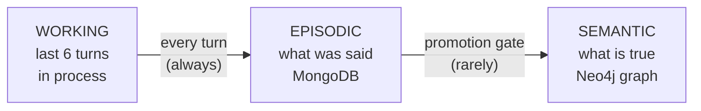
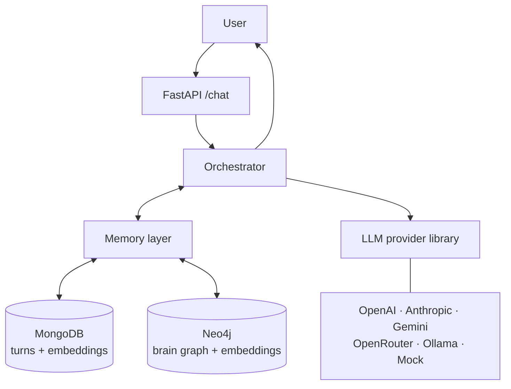
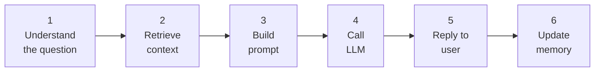
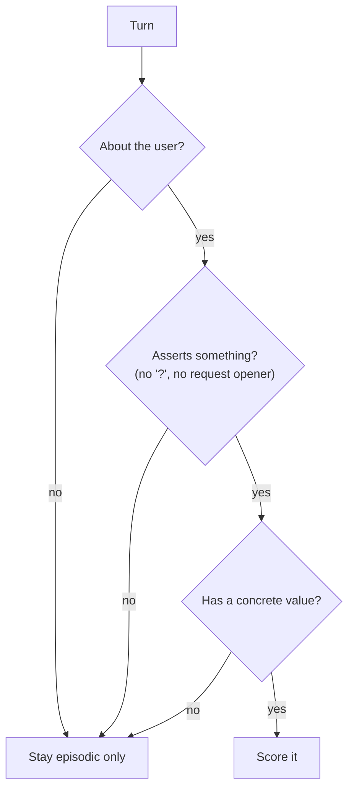
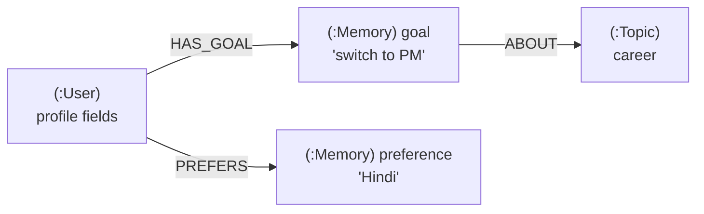
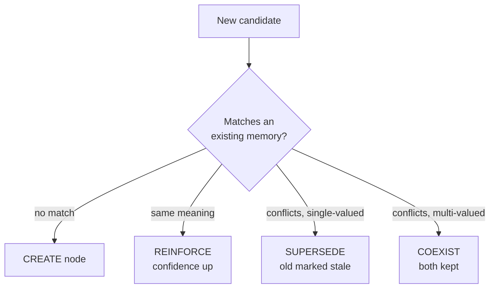
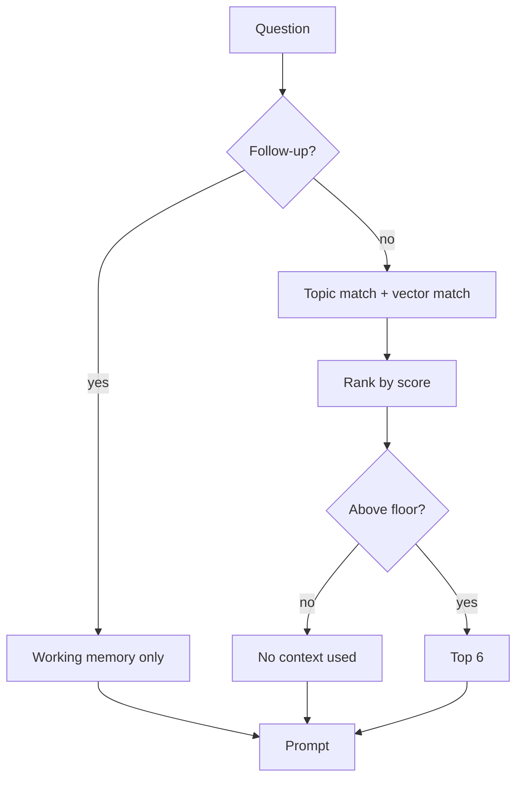
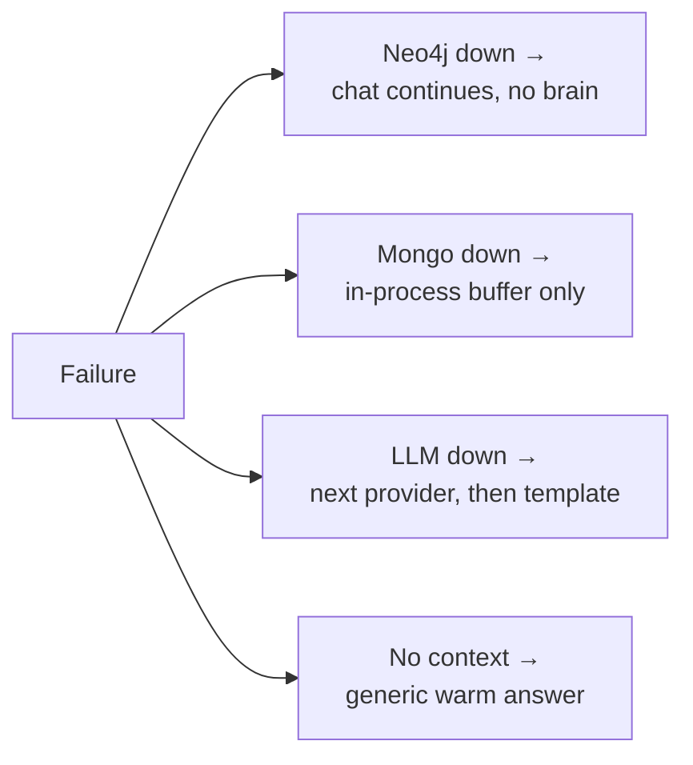
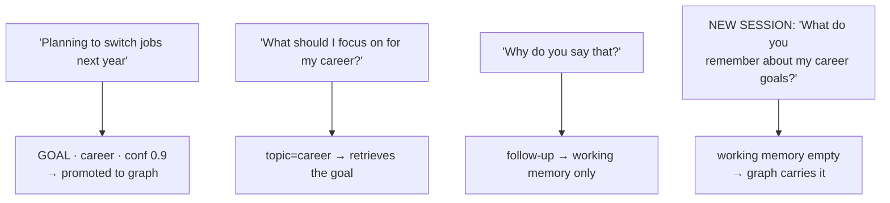

# MyNaksh — Personalized Astrology Chat
## Architecture & Flow

> Design document. No code yet.
>
> Every constant and formula here is justified in **[design-rationale.md](./design-rationale.md)** —
> what is derived, what is judgement, and what is an arbitrary prior awaiting eval.

---

## 1. The core idea

Three kinds of memory, each in the store that fits it:



| Tier | Holds | Store | Lifetime |
|---|---|---|---|
| **Working** | The last few turns of *this* conversation | in-process buffer | the session |
| **Episodic** | Every turn ever, verbatim | MongoDB | forever |
| **Semantic** | Durable *facts about the user* | Neo4j | forever, with decay |

The **Shared Brain** is the semantic tier — the Neo4j graph. The other two feed it.

The one rule that shapes everything: **everything flows into episodic, almost nothing is
promoted to semantic.** Promotion is the interesting decision, and §4 is how it's made.

---

## 2. System overview



---

## 3. What happens on one message



Steps 1–5 are the fast path; the user has their answer after step 5.
Step 6 runs afterward, so memory work never slows down or breaks the reply.

---

## 4. Classification: what becomes a long-term memory

This is a **promotion decision**, not a sorting decision. Every turn is already saved in
MongoDB. The only question is whether it *also* creates a fact in the graph.

### 4.1 Three hard gates (all must pass)



1. **Self-referential** — the subject is the user. "I am / I want / my …", not "what does Leo mean".
2. **Declarative** — it asserts a fact. A trailing `?` is not enough of a test: imperatives
   (*"Tell me about my career"*) and inverted questions (*"Should I switch jobs"*) are
   self-referential requests with no `?`, and were being promoted as facts until the
   opening word was checked too.
3. **Resolvable** — there is an actual value. "I want to do better" has none; "I want to move into product management" does.

### 4.2 The type taxonomy — this is what decides short vs long term

Every candidate is assigned a type. The type carries its own **half-life** and **cardinality**,
and those two numbers drive everything downstream — decay, retrieval weight, and whether a
new value replaces an old one.

| Type | Half-life | Cardinality | What it is |
|---|---|---|---|
| `IDENTITY` | ∞ | single | dob, birth place, birth time, sun sign |
| `PREFERENCE` | 24 mo | single per slot | language, tone, topics to avoid |
| `ATTRIBUTE` | 18 mo | single per slot | job, city, marital status |
| `INTEREST` | 12 mo | multi | entrepreneurship, meditation |
| `GOAL` | 9 mo *or* until target date | multi | switch jobs by 2027 |
| `EVENT` | 6 mo, then historical | multi | had an interview last week |
| `STATE` | **never promoted** | — | feeling anxious today, tired, busy this week |

**`STATE` is the general rule for "short-term".** Not a list of examples — a test:

> If this will probably be false in 30 days and knowing it later would be *misleading*
> rather than useful, it is a `STATE`. It stays episodic.

"I'm stressed about work today" is a `STATE`. Recalling it in four months makes the system
sound broken. But if stress about work is mentioned repeatedly across sessions, the
*pattern* is real — that gets promoted, as an `ATTRIBUTE`, by the reinforcement rule in §6.

### 4.3 The score

Candidates that pass the gates and aren't `STATE` are scored:

```
promotion = 0.35·durability + 0.25·specificity + 0.25·utility + 0.15·extraction_confidence
```

- **durability** — how long will this stay true (the type's half-life, normalized)
- **specificity** — is it a precise proposition or vague sentiment
- **utility** — would knowing this change a future answer
- **extraction_confidence** — how sure the extractor is it parsed the turn correctly

**Promote at ≥ 0.60.** Below that it stays episodic — still searchable by embedding, just
not a fact in the brain.

---

## 5. The brain graph



**Profile fields are properties on `:User`** (name, dob, tob, birth place, language, zodiac) —
one value each, always relevant, no node needed.

**Learned facts are `:Memory` nodes** — because each needs `confidence`, `importance`,
`last_affirmed`, provenance, and a correction history.

**`:Topic` nodes are shared** across memories, which is what makes retrieval a bounded
2-hop traversal instead of a scan.

Every `:Memory` also carries an `embedding` (Neo4j vector index) so retrieval can match on
meaning, not just topic keywords.

---

## 6. Updating weights, nodes and edges

Each `:Memory` carries three numbers:

| Field | Meaning | Changes when |
|---|---|---|
| `confidence` | how sure we are this is true | reaffirmed or contradicted |
| `importance` | how much it matters for personalization | fixed by type |
| `last_affirmed` | when the user last backed it up | every reaffirmation |

### 6.1 The four update outcomes



**Reinforce** — asymptotic, so repetition raises confidence but never overshoots:
```
confidence ← confidence + 0.15 × (1 − confidence)
last_affirmed ← now
```

**Supersede** — *only for single-valued slots.* A new city replaces the old city. A new
goal does **not** replace an old goal — a person can want two things at once.
```
new-[:SUPERSEDES]->old ;  old.status = 'superseded'
```

**Weak contradiction** — when it's ambiguous, don't delete, just lower trust:
```
confidence ← confidence × 0.7
```
Two weak hits in a row drop it below the retrieval floor and it quietly stops surfacing.

### 6.2 Decay is computed at read time, never written

```
decay = 0.5 ^ (days_since_affirmed / half_life)
```

No cron job, no background sweep. A memory nobody reaffirms simply scores lower each day
until it falls under the retrieval floor. `IDENTITY` has infinite half-life, so it never decays.

### 6.3 Edges between memories — deferred

A Hebbian `RELATED_TO` edge (memories co-retrieved without correction strengthen their link)
is a natural extension, but its one parameter cannot be chosen without data. Deferred until
the eval harness can fit it. Not in v1.

---

## 7. Retrieval



```
score = relevance × confidence × importance × decay
relevance = max(topic_match, embedding_cosine)
```

- **Topic match** is cheap and precise; **vector match** catches paraphrase the lexicon misses.
  Taking the max means either path alone can surface a memory.
- **The floor (0.25) matters as much as the ranking.** It makes "no relevant context" a real
  outcome, which is what stops unrelated memories leaking into prompts.
- **Follow-ups are decided by question type, not session boundary.** "Why do you say that?"
  asked mid-session and asked as message #1 behave the same way.

Two vector indexes serve different questions:

| Question | Store searched |
|---|---|
| "What is true about this user?" | Neo4j memory embeddings |
| "What did we actually discuss before?" | MongoDB turn embeddings |

---

## 8. Formula sheet

Every quantity the system computes, in one place. Rationale for each choice is in
[design-rationale.md](./design-rationale.md); tags below mark what is derived vs. tunable.

### 8.1 Notation

| Symbol | Meaning |
|---|---|
| `hl(T)` | half-life of type `T`, in months |
| `age` | months since `last_affirmed` |
| `c` | `confidence` of a memory, in [0,1] |
| `imp(T)` | retrieval importance prior of type `T` |
| `cos(a,b)` | cosine similarity of two embeddings |

---

### 8.2 Type constants  **[PRIOR — magnitudes]  [JUDGEMENT — ordering]**

| Type | `hl` | cardinality | `util_prior` | `imp` |
|---|---|---|---|---|
| `IDENTITY` | ∞ | single | 1.00 | 1.00 |
| `PREFERENCE` | 24 | single per slot | 0.80 | 0.70 |
| `ATTRIBUTE` | 18 | single per slot | 0.85 | 0.80 |
| `INTEREST` | 12 | multi | 0.60 | 0.60 |
| `GOAL` | 9 (or `target_date`) | multi | 0.90 | 0.90 |
| `EVENT` | 6 | multi | 0.50 | 0.50 |
| `STATE` | — never promoted — | | | |

`util_prior` and `imp` are near-identical today and may collapse into one constant if eval
shows they never diverge. They are kept separate because they act at different stages
(write-time vs. read-time).

---

### 8.3 Promotion — does this become a memory?

**Hard gates** (all must pass, no LLM needed):
```
self_referential  AND  declarative  AND  resolvable  AND  type != STATE
```

**Score:**
```
promotion = 0.35·durability + 0.25·specificity + 0.25·utility + 0.15·extraction_conf
promote if promotion >= 0.60
```

#### durability — from the type's half-life  **[JUDGEMENT]**
```
durability = hl / (hl + 12)          # IDENTITY: hl = ∞  ->  1.00
```
Saturating, monotonic, maps months onto [0,1] with a 12-month reference horizon.
EVENT 0.33 · GOAL 0.43 · INTEREST 0.50 · ATTRIBUTE 0.60 · PREFERENCE 0.67 · IDENTITY 1.00

#### specificity — is it a precise proposition?  **[JUDGEMENT]**
```
specificity = 0.45·concrete_value + 0.30·has_qualifier + 0.25·length_ok
```
| Feature | 1 when |
|---|---|
| `concrete_value` | the value is a noun phrase or named entity, not a bare sentiment |
| `has_qualifier` | a date, number, place or named entity is attached |
| `length_ok` | value is 2–8 tokens — shorter is vague, longer is a sentence, not a fact |

#### utility — would knowing this change a future answer?  **[JUDGEMENT]**
```
utility = 0.60·topic_supported + 0.40·util_prior(T)
```
`topic_supported` ∈ {0, 0.5, 1}: 1 if the memory maps to a life domain the product reasons
about (career, health, relationships, finance, family, education, spiritual), 0.5 for an
adjacent lifestyle topic, 0 otherwise.

*This term is what rejects trivia.* "I had tea at 4pm" is a perfectly specific, perfectly
extracted `EVENT` — only `topic_supported = 0` keeps it out of the brain.

**Production refinement** — once there is a user base, blend in inverse document frequency,
so facts everyone shares score lower:
```
utility ← (1−λ)·utility + λ·norm_idf(value)
λ = min(1, n_users / 1000)
```

#### extraction_conf — did we parse the turn correctly?  **[JUDGEMENT]**
```
extraction_conf = 0.40·llm_self_report + 0.40·grounding + 0.20·slots_complete
grounding = |tokens(value) ∩ tokens(source_message)| / |tokens(value)|
```
`grounding` is the anti-hallucination term: a value the extractor invented will not appear
in the user's own words. It is weighted equal to the model's self-report because
self-reported confidence alone is unreliable.

---

### 8.4 Matching an incoming candidate to existing memories  **[PRIOR — thresholds]**

```
sim = cos(candidate.embedding, closest existing memory of the same type)
same_slot = candidate.topic == existing.topic

sim >= 0.85                                     -> REINFORCE  (same meaning)
single-valued AND same_slot AND value differs   -> SUPERSEDE  (checked before sim)
sim <  0.55                                     -> CREATE     (unrelated)
otherwise, multi-valued                         -> COEXIST
otherwise, single-valued                        -> WEAK CONTRADICTION
```

**Cardinality, not similarity, authorizes a supersede** — and the ordering above matters.
Supersede is tested *before* the similarity floor, because a single-valued slot can hold
exactly one value however the embedder happens to score the two phrasings. Checking
similarity first was a real bug: `"living in Delhi"` vs `"living in Bangalore"` scores 0.67
under the shipped embedder, so a similarity-gated supersede silently left both cities
active. Two `GOAL`s about career are both true; two values for `city` cannot be.

> **The thresholds 0.85 / 0.55 are calibrated for the hashed bag-of-words embedder in
> `utils.embed`, not for a semantic model.** A one-word difference scores ~0.67 there.
> Both numbers must be refit when a real embedding model is swapped in — this is the same
> trap flagged for the cosine band in 8.7.

---

### 8.5 Confidence updates  **[DERIVED — form]  [PRIOR — rates]**

```
REINFORCE:            c ← c + 0.15·(1 − c)      ; last_affirmed ← now
WEAK CONTRADICTION:   c ← c × 0.70
SUPERSEDE:            old.status ← 'superseded' ; c_new ← max(extraction_conf, 0.75)
CREATE:               c ← extraction_conf
```
Asymptotic by construction — `c` can never exceed 1.0, and repetition yields diminishing
returns. Contradiction is deliberately stronger than confirmation.

---

### 8.6 Decay — computed at read time, never written  **[STANDARD — form]**

```
decay = 0.5 ^ (age / hl)             # IDENTITY: decay = 1.0 always
```
If `T = GOAL` and `target_date` has passed, the memory is reclassified `EVENT` and re-dated
rather than decayed — an explicit date beats a statistical default.

---

### 8.7 Retrieval  **[DERIVED — form]  [PRIOR — thresholds]**

```
score = relevance × c × imp(T) × decay
include if score >= 0.25 , take top K = 6
```

#### relevance
```
relevance = max(topic_match, rescaled_cos)
```

```
topic_match:   exact topic        1.0
               parent/child topic 0.6
               sibling topic      0.3
               no match           0.0

rescaled_cos = clip( (cos(q, m) − 0.55) / (0.95 − 0.55), 0, 1 )
```
The rescale is **required**, not cosmetic: raw cosine rarely drops below ~0.5 even for
unrelated text, so a naive `max` against a {0,1} topic score would let the vector channel
win every comparison. Band edges are embedding-model-specific and must be re-fitted from
the observed cosine distribution before trusting them.

---

### 8.8 Follow-up detection  **[JUDGEMENT]**

```
followup = 0.40·no_new_content_word + 0.30·has_anaphora + 0.20·is_short + 0.10·is_why
is_followup if followup >= 0.50
```
| Feature | 1 when |
|---|---|
| `no_new_content_word` | every content word already appears in the last 2 turns |
| `has_anaphora` | contains "that / it / this / they" with no local referent |
| `is_short` | ≤ 6 tokens |
| `is_why` | opens with why / how come / explain / what do you mean |

When `is_followup`, graph retrieval is skipped and the working-memory window carries the turn.
Decided by **question shape, not session boundary** — a follow-up behaves identically at
turn 2 and turn 40.

---

### 8.9 Context budget  **[PRIOR]**

```
total prompt budget       3000 tokens
  system + preferences     300
  profile / identity block 300
  retrieved memories       900   (K=6, truncated at ~150 each)
  conversation window      900   (last N=6 turns, oldest dropped first)
  current message          300
  headroom                 300
```
Memories and history are each capped independently, so a long conversation can never
crowd out the brain, and a memory-rich user can never crowd out the conversation.

---

### 8.10 Worked calibration

Running §8.3 by hand. These are the numbers the thresholds were sanity-checked against:

| Candidate | Type | spec | util | **score** | Verdict |
|---|---|---:|---:|---:|---|
| "works as an engineer in Bangalore" | ATTRIBUTE | 1.00 | 0.94 | **0.830** | promote |
| "prefers Hindi" | PREFERENCE | 0.70 | 0.92 | **0.781** | promote |
| "switch to product management by 2027" | GOAL | 1.00 | 0.96 | **0.775** | promote |
| "had a job interview last week" | EVENT | 1.00 | 0.80 | **0.702** | promote |
| "I like travel" | INTEREST | 0.70 | 0.54 | **0.613** | promote *(thin margin)* |
| "watched a movie yesterday" | EVENT | 1.00 | 0.20 | **0.544** | reject |
| "I had tea at 4pm" | EVENT | 1.00 | 0.20 | **0.552** | reject |

Two structural consequences fall out of this table and are worth stating explicitly:

1. **`utility` is the only term doing the rejecting.** The two rejected rows are perfectly
   specific and perfectly extracted — they score 1.00 on specificity. Only
   `topic_supported = 0` keeps them out. If `topic_supported` is implemented sloppily, the
   junk filter is effectively gone.
2. **`EVENT` has the lowest durability (0.33), so it only clears the bar with strong topic
   support.** That is intended — an undated, off-topic event is exactly what should not be
   remembered — but it means the `EVENT` type is one threshold nudge away from never
   promoting at all. Watch it in eval.

`INTEREST` at 0.613 sits only 0.013 above the threshold. Interests are the class most
sensitive to retuning constant #1.

Confidence trajectories under §8.5:
```
reinforce from 0.60:   0.660  0.711  0.754  0.791  0.823   (asymptotic, never reaches 1)
contradict from 0.90:  0.630  0.441  0.309
```

**How fast a contradicted memory disappears depends on its type**, because the floor is
applied to the *product*, not to confidence alone. Measured:

| after n contradictions | confidence | `EVENT` score (imp 0.5) | `GOAL` score (imp 0.9) |
|---|---:|---:|---:|
| 1 | 0.630 | 0.315 | 0.567 |
| 2 | 0.441 | **0.220 — below floor** | 0.397 |
| 3 | 0.309 | 0.154 | 0.278 |

An earlier draft of this doc claimed "below the floor after two hits" without qualification.
That is only true for low-importance types. A `GOAL` survives three contradictions and needs
decay as well — which is the correct behaviour (a life goal should not be erased by two
ambiguous remarks) but it is not what the text said.

---

### 8.11 Index of tunable constants

| # | Constant | Value | Tag | Wrong when |
|---|---|---|---|---|
| 1 | promotion threshold | 0.60 | PRIOR | brain fills with junk / forgets obvious facts |
| 2 | cosine rescale band | 0.55–0.95 | PRIOR | vector channel dominates or never fires |
| 3 | retrieval floor | 0.25 | PRIOR | irrelevant context leaks / context empty too often |
| 4 | half-life magnitudes | 6–24 mo | PRIOR | stale facts resurface / recent facts vanish |
| 5 | promotion weights | .35/.25/.25/.15 | PRIOR | one failure mode dominates the error set |
| 6 | reinforce rate α | 0.15 | PRIOR | confidence saturates too fast or never moves |
| 7 | match thresholds | 0.85 / 0.55 | PRIOR | duplicate memories / missed reinforcements |
| 8 | contradiction factor | 0.70 | PRIOR | corrections ignored / memories deleted too easily |
| 9 | K, N | 6, 6 | PRIOR | prompt bloat / missing context |
| 10 | durability horizon | 12 mo | JUDGEMENT | durability stops discriminating between types |

Anything tagged **DERIVED** in the rationale doc is *not* a tuning target — if one of those
is wrong, the structure is wrong and the fix is a redesign.

---

## 9. MongoDB — session store

```
sessions: { session_id, user_id, started_at, last_active, turn_count, summary }
turns:    { session_id, user_id, seq, role, content, ts, embedding, memory_ids[] }
```

Indexes: `{session_id, seq}` for last-N reads, `{user_id, ts}` for cross-session history,
and a vector index on `turns.embedding`.

**Why Mongo:** turns are append-only documents of varying shape, last-N is a single indexed
sort, and the vector index lives in the same store — no third system for episodic search.
Only **user** turns are embedded; assistant turns are stored but not embedded.

---

## 10. Failure handling



Every branch still returns an answer, with a flag saying what was degraded. No expected
failure returns a 500.

---

## 11. Worked example



---

## 12. Evaluating whether the brain helps

> Full plan in **[evals.md](./evals.md)**. Summary below.

Run fixed conversation scripts twice — retrieval **on** vs **off** — and compare:

| Axis | Measured by |
|---|---|
| Memory accuracy | golden (message → expected memory) pairs |
| Context relevance | precision@K of `context_used` vs hand labels |
| Personalization | blind LLM-judge A/B on the two answer sets |
| Consistency | multi-turn scripts checked for contradiction |
| Irrelevant context | false-positive rate in `context_used` |

Plus one operational metric: **average memories injected per turn.** If it climbs over
time, retrieval is drifting toward "send the whole graph."

---

## 13. Known trade-offs

- **Scoring constants are priors, not tuned values.** Accepted deliberately: they are
  initial values with a stated derivation (see design-rationale.md), and the eval harness
  in §11 is the mechanism that tunes them. Shipping a defensible prior beats shipping none.
- **Extraction costs one LLM call per turn.** Accepted for v1. Mitigation (cheap model +
  first-person pre-filter) is designed but not the priority.
- **`RELATED_TO` co-activation is deferred** — one unfittable parameter, no data to fit it.
- **Supersede depends on the cardinality rule.** Two goals about career are not a
  contradiction. Only single-valued slots supersede; this is the highest-risk logic in
  the system and gets dedicated tests.
- **Three stores** (Mongo, Neo4j, vector indexes) is real operational weight; each has a
  fallback so one outage degrades rather than breaks.

---

## 14. Production considerations

Async memory writes via a queue · prompt caching on the stable profile prefix · PII
encryption for birth data · per-user delete · graph queries always scoped by `user_id` ·
cheap model for classification/extraction, strong model for the reply.
