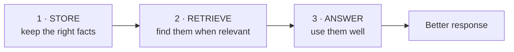
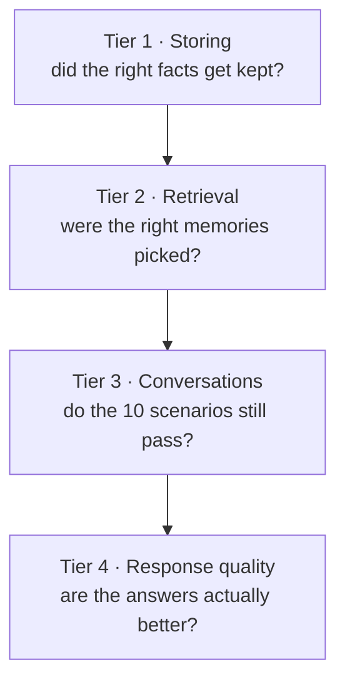
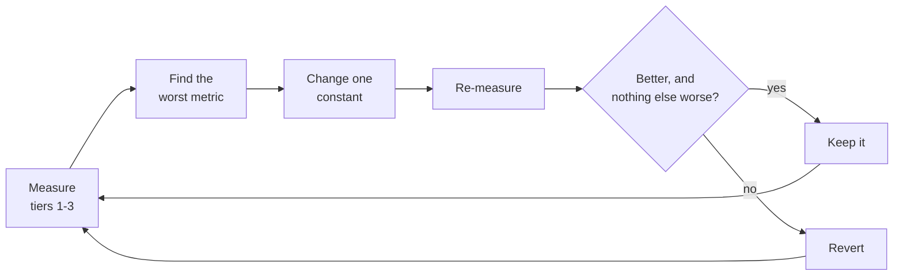
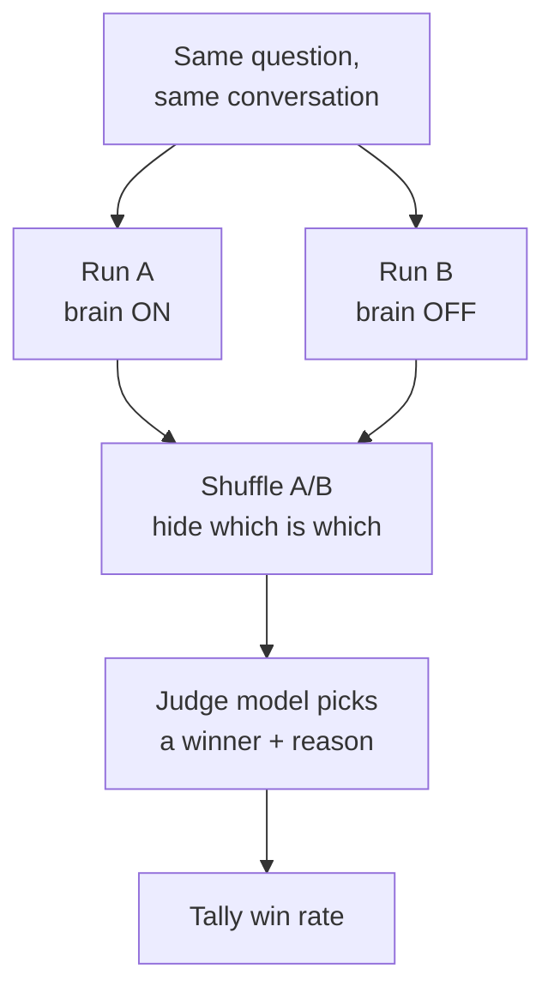
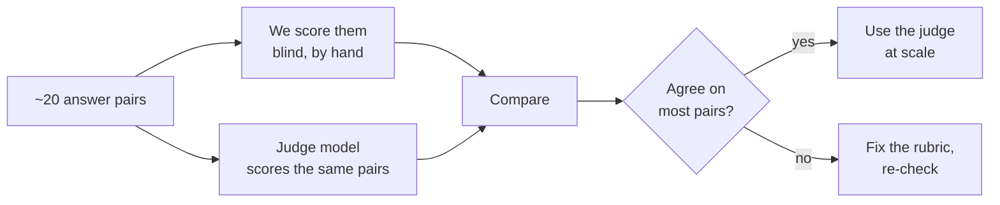
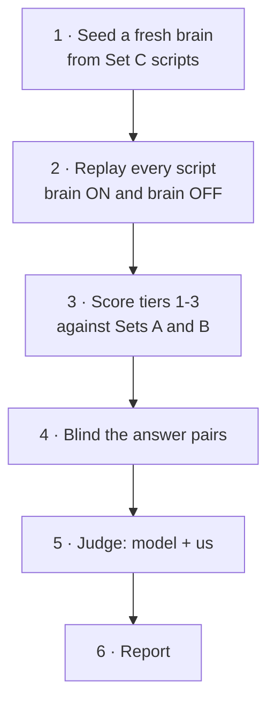
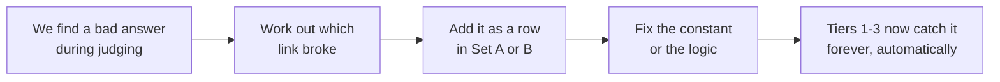

# Evaluation Plan

> How we check whether the Shared Brain actually makes answers better, and how we use that
> to pick the right numbers. Design only — nothing here is built yet.
>
> Companion docs: [architecture.md](./architecture.md) (what the system does),
> [design-rationale.md](./design-rationale.md) (why each constant has its value).

---

## 1. Why we are doing this

Every constant in the system is a **guess**. The promotion threshold is 0.60 because 0.60
produced sensible behaviour on a handful of examples — not because data said so.

Evals turn those guesses into measured choices, and answer one question:

> **Does the Shared Brain make responses better, or does it just make them longer?**

A system that remembers the wrong things is worse than one that remembers nothing. It
injects stale facts, contradicts itself, and sounds confidently wrong about the user.

---

## 2. Where things can break

The brain only helps if three separate things all go right:



Each link fails on its own:

| Link | What failure looks like |
|---|---|
| **Store** | remembers "I had tea at 4pm"; forgets "I want to switch careers" |
| **Retrieve** | has the career goal but does not surface it when asked about career |
| **Answer** | has the right context but produces generic horoscope filler anyway |

**One score cannot tell us which link broke.** So we measure each link separately, *and*
judge the final answer. Per-link metrics tell us **where** to fix; the final judgment tells
us **whether** it is working at all.

---

## 3. What we measure

Four tiers, cheapest first.



| Tier | Needs | Speed | Runs in CI |
|---|---|---|---|
| 1 Storing | nothing | milliseconds | yes |
| 2 Retrieval | nothing | milliseconds | yes |
| 3 Conversations | mock provider | seconds | yes |
| 4 Quality | a real API key | minutes, costs money | no |

Tiers 1–3 run offline on the mock provider. That matters: we can re-run them after every
single change to a constant. Tier 4 we run occasionally, as a verdict.

---

## 4. The golden dataset

Three files. This is most of the actual work.

### Set A — messages and what should happen to them (~60 rows)

```
message                                    | decision  | type      | topic
-------------------------------------------|-----------|-----------|--------
I'm planning to switch jobs next year      | STORE     | GOAL      | career
I work as an engineer in Bangalore         | STORE     | ATTRIBUTE | career
I prefer replies in Hindi                  | STORE     | PREFERENCE| -
I had tea at 4pm                           | DISCARD   | -         | -
Tell me what my chart says about money     | DISCARD   | -         | -
I'm stressed about work today              | DISCARD   | STATE     | -
Actually I'm moving to Bangalore, not Delhi| SUPERSEDE | ATTRIBUTE | travel
I also want to start my own company        | COEXIST   | GOAL      | career
```

Roughly **half the rows must be things we should NOT store.** A set full of easy positives
proves nothing — the hard part of this system is refusing.

Hard negatives to include deliberately:
- questions (`?`) and **imperatives without a `?`** ("Tell me…", "Show me…")
- transient states ("I'm tired today")
- specific-but-useless trivia ("I had tea at 4pm")
- near-duplicates of things already stored
- corrections of single-valued facts (city) vs additions of multi-valued ones (goals)

### Set B — questions and which memories should surface (~40 rows)

Against one fixed brain of ~20 memories.

```
question                              | should retrieve
--------------------------------------|---------------------------
What should I focus on for my career? | [career_goal, job_attribute]
Tell me about my health               | []            <- nothing is relevant
Why do you say that?                  | []            <- follow-up, use conversation
```

The rows expecting `[]` are the important ones. They test whether the system can say
"nothing here is relevant" instead of always returning its six best guesses.

### Set C — conversation scripts (~10)

Multi-turn, covering the assignment's scenarios: new user, memory creation, retrieval,
follow-up, new session, irrelevant chatter, correction, missing profile. Half of these
already exist as pytest scenarios; the eval version also keeps the final answers for Tier 4.

### Labelling rules come first

We write the **rules** before the labels:

> Store it if it will still be true in 30 days AND knowing it would change a future answer.
> Requests are never facts. Moods are never facts.

If we disagree about a row, we argue about the **rule**, not the row. That keeps
disagreements to two minutes and makes the labels defensible to someone else.

---

## 5. How we find the right weights

### The loop



**One constant at a time.** Change two and you cannot attribute the result.

### Not every constant can be tuned now

The ten constants split into three groups by what kind of eval can reach them:

| Group | Constants | Status |
|---|---|---|
| **Static** | promotion threshold, retrieval floor, promotion weights, K and N | **Tune now.** Sets A and B measure them directly. |
| **Embedder-dependent** | cosine band, match thresholds | **Defer.** Calibrated for the hashed bag-of-words embedder; every number refits when a real embedding model goes in. Tuning them now is wasted work. |
| **Time-dependent** | half-lives, reinforce rate, contradiction factor, durability horizon | **Defer.** These operate over *months*. Measuring them needs a simulated clock that fast-forwards `last_affirmed` — different machinery, out of scope for now. |

### Every metric needs a counter-metric

Any constant can be "improved" by breaking something else. So we always watch both sides:

| Move this | Improves | Must not get worse |
|---|---|---|
| promotion threshold ↓ | facts captured | junk stored per 10 turns |
| retrieval floor ↓ | relevant context found | irrelevant context injected |
| K ↑ | coverage | precision, prompt size |

A change is only kept if the primary metric improves **and** the counter-metric holds.

### One operational number to watch always

**Average memories injected per turn.** If it creeps up over time, retrieval is drifting
back toward "send the whole graph" — the exact thing the design exists to prevent.

---

## 6. LLM as a judge

Tiers 1–3 compare against labels, so they are objective. Tier 4 asks "is this answer
*better*", which has no label. That is what a judge is for.

### The method: blind pairwise comparison



Pairwise, not scoring out of 5. Forced choice between two answers is far more stable than
an absolute rating, which drifts between runs and between models.

### Rules that make the result mean something

| Rule | Why |
|---|---|
| **Judge ≠ generator** | A model prefers its own output. Generate with one, judge with another. |
| **Temperature 0 on both arms** | Otherwise we are partly judging random sampling, not context. |
| **Swap positions, run twice** | Judges favour whichever answer comes first. Swapping cancels it. |
| **Allow "tie"** | Forcing a winner on identical answers manufactures a signal. |
| **Ask for a reason** | The reason points at which constant to change. A bare score does not. |

### The trap: personalization theatre

An answer that name-drops the user's career goal **looks** better while giving worse advice.
If we only ask "which is more personalized", brain-on wins automatically and we have proven
nothing.

So we ask **two separate questions** about every pair:

1. Which answer is **more personalized** to this user?
2. Which answer is **better advice**?

> If personalization goes up and advice quality does not, the brain is decorative.
> That is the single most important thing this eval can tell us.

### The other trap: invented facts

The worst failure is an answer referencing something about the user that is in **neither**
the brain nor the conversation. We check every judged answer for this separately — it is a
correctness bug, not a quality preference, and one occurrence outweighs a win.

---

## 7. Calibrating the judge against ourselves

A judge is only useful if it agrees with us. So we do not trust it until we have checked.



**Steps:**

1. Generate ~20 pairs from Set C.
2. Shuffle them. Write the brain-on/brain-off key to a **separate file we do not open**.
3. We score them by hand: more personalized? better advice? any invented facts?
4. Run the judge model on the same pairs.
5. Reveal the key. Compare judge to human.

If they broadly agree, the judge can scale to hundreds of pairs. If they disagree, the
rubric is wrong and we fix the rubric — not the labels.

### Include control pairs

Add 3–4 pairs where brain-on and brain-off *should* be nearly identical — questions with no
relevant memories stored.

> If we (or the judge) systematically prefer one side on the controls, the judging is
> biased and every other result from that run is suspect.

This is the cheapest available check on our own objectivity, and it costs four extra rows.

---

## 8. How we actually run it



**Step by step:**

1. **Reset.** Start from an empty graph so runs are comparable. Same seed, same fixtures.
2. **Replay.** Run each script twice — retrieval on, retrieval off — with temperature 0.
3. **Score the objective tiers** against Sets A and B. This is a table of numbers.
4. **Blind.** Shuffle each answer pair, write the key aside.
5. **Judge.** Model judges all pairs; we hand-judge the ~20 calibration pairs.
6. **Report.** One JSON file plus a printed table.

### What the report shows

```
TIER 1  storing
  promotion accuracy      84%   (correct decision on 50/60 messages)
  junk stored              2    (should be 0)
  facts missed             6

TIER 2  retrieval
  precision@6             0.78
  recall                  0.71
  correct "no context"    9/11  (said nothing when nothing was relevant)

TIER 3  conversations     10/10 scenarios pass

TIER 4  quality  (brain ON vs OFF, 24 pairs)
  better advice           15 - 5 - 4 ties
  more personalized       19 - 2 - 3 ties
  invented facts          1        <- investigate before anything else
  controls                2 - 2    <- balanced, so judging looks unbiased

OPERATIONAL
  memories injected/turn  1.8
```

### Reading it

- **Advice 15–5 with personalization 19–2** → the brain helps, and not only cosmetically.
- **Personalization 19–2 but advice 10–10** → decorative. Fix retrieval relevance, not more memory.
- **Invented facts > 0** → stop. Fix before tuning anything else.
- **Controls lopsided** → our judging is biased; the run tells us nothing.

> With ~24 pairs we get a **direction, not a measurement**. 15–5 is meaningful. 13–11 is
> noise. We agree on that before looking, so we do not over-read a narrow result afterwards.

---

## 9. How this improves the system

The loop compounds, because judging **produces** new test cases:



Every mistake we notice once becomes a permanent regression test. The eval set gets
**better over time instead of going stale**, and problems we have already seen cannot come
back silently.

This is not hypothetical. Two bugs already found by looking at real output would have been
caught by Set A on the first run:

- `"Tell me what my chart says"` stored as a fact, because the gate only checked for a `?`
- a city change that did not supersede the old city, because similarity was checked before
  cardinality

Both are now permanent rows in the test suite.

---

## 10. What we are deliberately not doing

- **No eval framework.** A script in `backend/evals/` that prints a table and writes JSON.
  The brief says a sophisticated framework is not required, and it would not earn its keep.
- **No tuning of embedder-dependent constants** until the embedding model is final.
- **No decay tuning** until there is a simulated clock.
- **No statistical claims.** ~60 labelled messages and ~24 judged pairs support coarse
  choices (0.6 vs 0.5), never fine ones (0.60 vs 0.62). Saying otherwise would be false precision.

### Honest limitations

| Limitation | What we do about it |
|---|---|
| We wrote the labels, so we grade our own homework | Write the labelling **rules** down first, so a reviewer can challenge the rule |
| No real users; "quality" is a proxy | Say so plainly rather than implying otherwise |
| Small sample sizes | Report direction, not percentages with decimal places |
| Judge may inherit model biases | Calibrate against our own blind scoring before trusting it |

---

## 11. Order of work

| # | Step | Unlocks |
|---|---|---|
| 1 | Write the labelling rules | everything else |
| 2 | Build Set A (~60 messages) | tier 1 — catches storing bugs, runs offline |
| 3 | Build Set B (~40 queries) | tier 2 — tunes the retrieval floor and K |
| 4 | Wire Sets A and B into a runner | the tuning loop |
| 5 | Tune the four static constants | measured values instead of guesses |
| 6 | Build Set C + blinded pair generation | tier 4 |
| 7 | Calibrate judge vs our blind scoring | trust the judge at scale |
| 8 | Run the full report | the verdict |

Steps 1–5 need no API key and no money. Step 6 onward does.
